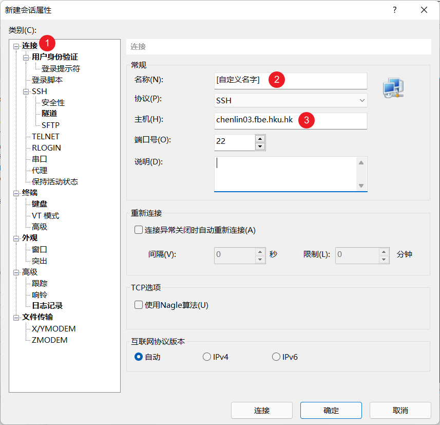
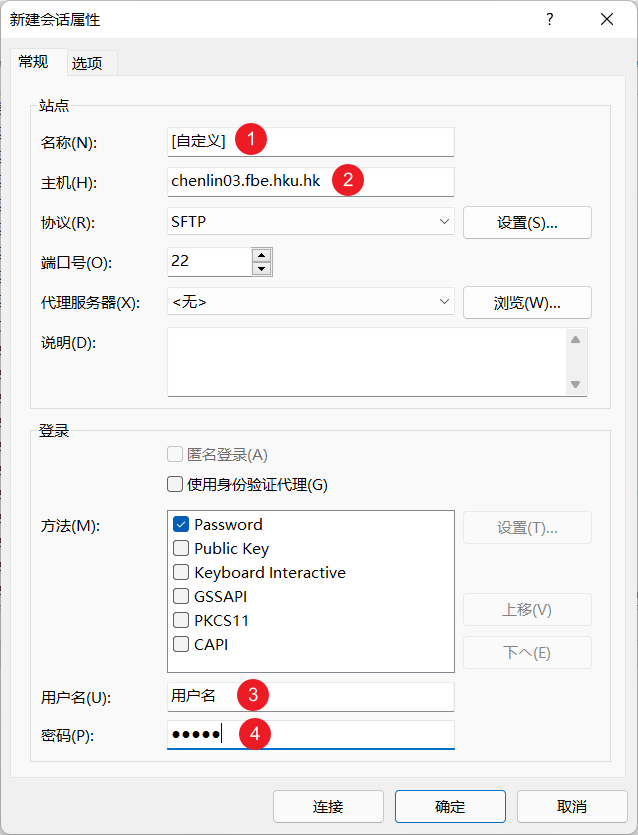
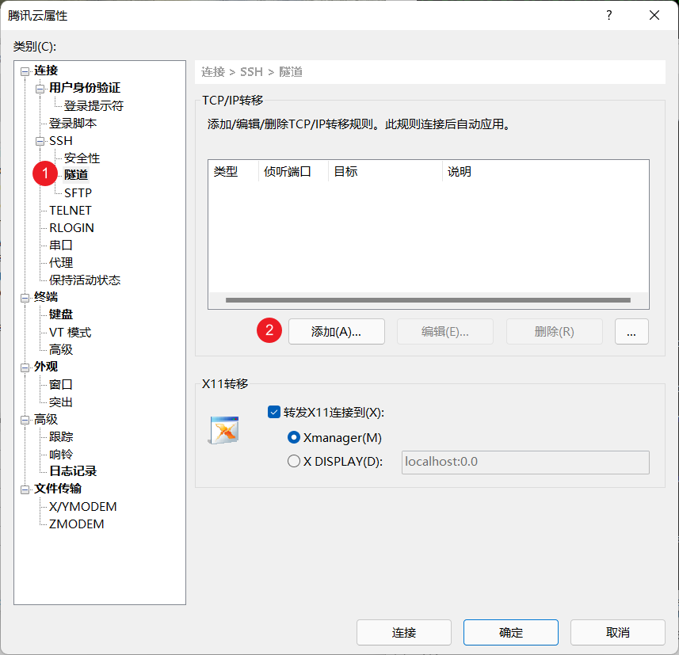
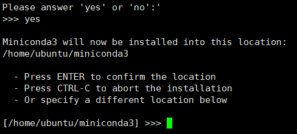
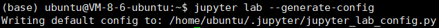
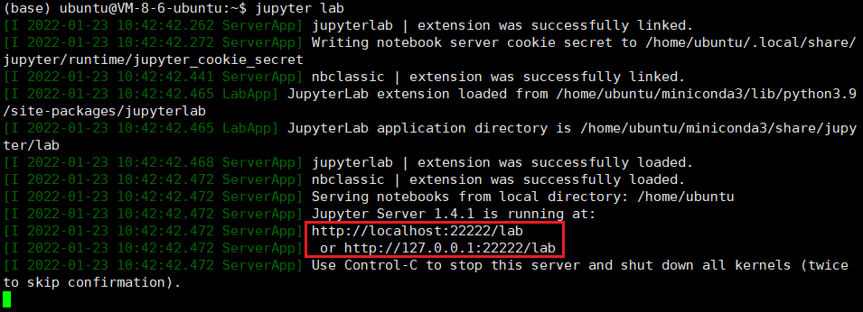
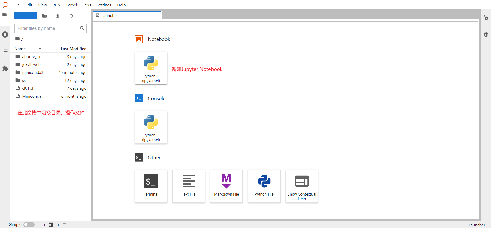
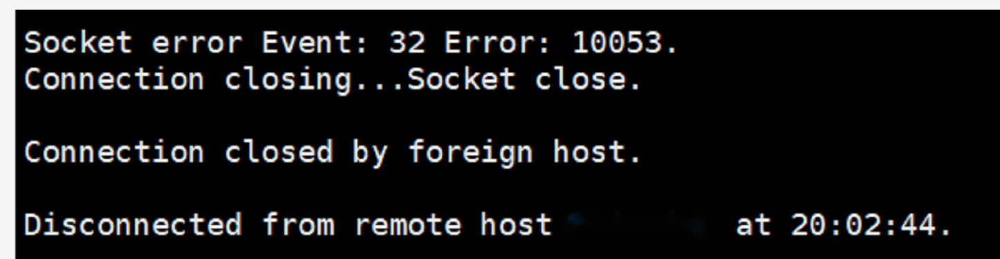

[ToC]

# 服务器使用手册

## 0. 引言

本手册提供了从基础到进阶的多个使用指引。若此前并不熟悉Linux系统及远程服务器交互，请首先完成“必要步骤”的操作。“其他”中则提供了一些有助于提高工作效率、但并非必要的指引。

- 必要步骤
  - 登陆服务器
  - Conda
  - Jupyter Lab
- 其他
  - Linux常用指令
  - Screen
  - Jupyter Lab基本操作
  - Jupyter Lab中使用其他语言


## 1. 登录服务器

服务器通过[SSH](https://en.wikipedia.org/wiki/Secure_Shell)的方式进行命令的交互，通过[SFTP](https://en.wikipedia.org/wiki/SSH_File_Transfer_Protocol)的方式进行文件的传输。在不同的操作系统中，对于SSH和SFTP客户端有不同的推荐。

### 1.1. Windows

推荐使用Xshell和Xftp连接服务器，免费版可以通过此[链接](https://www.xshell.com/zh/free-for-home-school/)下载。

#### SSH (Xshell)

1. 新建会话。


2. 输入连接配置。



3. 输入用户名及密码。


4. 点击“连接”或会话管理器中保存的配置，即可登入服务器。出现`用户名@chenlin03`字样表示已成功登入。


#### SFTP (Xftp)

1. 输入配置后点链接即可进入文件管理界面。



2. 随后可以在此处查看保存的配置并登入。


3. 右键文件即可在本地和服务器之间传输文件。


#### 端口侦听

此部分的设置对使用Jupyter Lab非常关键，请务必先完成此步骤再配置Jupyter Lab。端口号请向管理员申请，可以在20000-49999之间选择任意数字。**此处以22222端口为例。**

1. 在会话管理器中右键，进入会话配置的属性。


2. 添加端口侦听规则。




3. 重新连接会话使端口侦听生效。

### 1.2. Mac

#### SSH (Terminal)

在Terminal中输入如下命令即可登入：

```bash
ssh <username>@chenlin03.fbe.hku.hk
```

#### SFTP (FileZilla)

推荐使用[FileZilla](https://filezilla-project.org/download.php?platform=osx)。配置可参考Windows的SFTP章节。FileZilla默认不会指明端口号，请填写端口号为22。

#### 端口侦听

此部分的设置对使用Jupyter Lab非常关键，请务必先完成此步骤再配置Jupyter Lab。端口号请向管理员申请，可以在20000-49999之间选择任意数字。**此处以22222端口为例。**

如需要使用Jupyter Lab，请在Terminal登陆时使用如下命令

```bash
ssh -L 22222:127.0.0.1:22222 <username>@chenlin03.fbe.hku.hk
```

### 1.3. Q.A.

Q1: SSH连接时出现错误提示`Are you sure you want to continue connecting (yes/no/[fingerprint])? Host key verification failed.`

- 原因：需要重置一下本地SSH记录的known_hosts
- 解决方案：
  1. 先获取目标服务器的IP地址，如147.8.117.185
  2. 执行命令`ssh-keygen -R 147.8.117.185`

## 2. Conda

推荐在Conda下配置环境。以下为Conda的安装和使用说明。

### 2.1. 安装

1. 下载安装包：登入服务器后，输入以下命令。

```bash
wget https://repo.anaconda.com/miniconda/Miniconda3-latest-Linux-x86_64.sh
```


2. 执行安装包。

```bash
bash Miniconda3-latest-Linux-x86_64.sh
```

3. 全部保持默认配置即可（yes/no选yes，其余一路按回车）。



4. 出现以下提示时，请输入yes，以自动激活conda环境。


5. 出现以下提示表示安装已完成。


6. 激活Conda环境。

```bash
source ~/.bashrc
```

7. 若命令行出现`(base)`前缀，则表示安装已完成。通过以下命令可以检查现有环境中的Python和Conda版本。


```bash
python --version
conda --version
```


8. 推荐执行以下步骤将[conda-forge](https://conda-forge.org/)设为主要的更新渠道。

```bash
conda config --add channels conda-forge
conda config --set channel_priority strict
```

### 2.2. Q&A

**Q1：在第6~7步未能成功激活Conda环境**


- 原因：在第4步时没有输入`yes`。

- 解决方案：

```bash
~/miniconda3/condabin/conda init
```


此后再执行6-7步即可。

## 3. Jupyter Lab

推荐使用JupyterLab在服务器上直接编写和运行代码。

### 3.1. 安装

0. **在配置Jupyter Lab之前，请务必确保已按照第一节“连接服务器”中配置了端口侦听。**

1. 在Conda环境中安装Jupyter Lab。

```bash
conda install jupyterlab
```

2. 检查安装情况。

```bash
jupyter lab --version
```


3. 创建Jupyter Lab配置文件。

```bash
jupyter lab --generate-config
```



注意返回的提示，指明了配置文件存放的位置。

4. 使用SFTP客户端将配置文件下载到自己的计算机进行编辑


5. 搜索以下配置项，取消注释，并改为指定的值

启动Jupyter Lab后不打开浏览器（否则会在服务器端打开浏览器）。


在指定的端口启动Jupyter Lab。端口号请向管理员申请，可以在20000-49999之间选择任意数字。此处以22222端口为例。


在服务器中启动Python。

```bash
python
```

输入以下命令生成密码的加密字符串。

```python
from jupyter_server.auth import passwd; passwd()
```


将`sha1:`开头的字符串拷贝到配置文件的如下位置。


退出Python。

```python
exit()
```

6. 通过SFTP将修改好的配置文件传输回服务器上的原位置，替换原本的配置文件。

### 3.2. 执行

7. 尝试启动Jupyter Lab。在服务器中输入以下命令

```bash
jupyter lab
```



若出现两个链接且链接的结尾是`/lab`，表明Jupyter Lab配置完成。

若链接的结尾有一串形同加密字符串的内容，说明在第5步中没有正确配置密码。

8. 打开本地浏览器，访问上述任一网址。输入在第5步中设置的密码。





## 4. Screen

在SSH终端中启动Jupyter Lab时，一旦出现网络连接波动或者不小心关闭了SSH终端，服务器上的Jupyter Lab就会被关闭，因此代码也随之终止运行。



此时需要引入`screen`命令来帮助解决改问题。`screen`命令会在服务器上创建一个独立的桌面，在该桌面中运行的程序不会因为SSH连接的中断而中断。以下为`screen`命令的几个主要使用方法：

- `screen -ls`：查看当前有哪些桌面
- `screen -S xxx`：创建一个名字为xxx的桌面
- `screen -r yyy`：进入名字为yyy的桌面
- Ctrl + A + D：退出当前桌面，回到SSH连接的主界面
- `kill 37821`：假设某个桌面对应的进程号是37821，通过该命令可以强行关闭该桌面

### 4.1. 执行

具体的执行步骤如下：

1. 首先检查当前账号下已经挂载了哪些桌面

```bash
screen -ls
```


如图，我的账号下已有两个桌面：wrds（进程号为60136）和dnb（进程号为7292）

2. 如果确定没有任何一个桌面是专门用来运行Jupyter Lab的，则新建一个桌面。通常可以命名为`nb`（notebook的缩写）。

```bash
screen -S nb
```

3. 运行该命令后会进入到一个全新的桌面，在该桌面中运行任何程序不会收到网络波动或SSH终端关闭的影响。因此可以如常启动Jupyter Lab。

```bash
jupyter lab
```

4. Jupyter Lab正常启动后，键盘上按Ctrl + A +D退出该桌面，回到原本的SSH界面。
4. 此后可以随意关闭SSH终端或切换网络等。重新连上SSH终端后，**不必**再回到该桌面，即可直接通过浏览器访问Jupyter Lab。
5. 随后如果希望回到该桌面执行重启Jupyter Lab等操作，可以使用该命令：

```bash
screen -r nb
```

### 4.2. Q&A

**Q1：执行`screen -r nb`失败，未能正常切换到名为`nb`的桌面。**


- 原因：这往往是因为此前未通过Ctrl + A +D的方式正常退出`nb`桌面，使得该桌面仍为“挂载”状态（Attached）。程序认为该桌面仍被占用，因此我们不能进入。
- 解决方法：先使用Ctrl + A +D确保回到最外层的SSH界面，然后执行`screen -d nb`来解除`nb`桌面的占用状态。之后就可以通过`screen -r nb`正常进入了。


